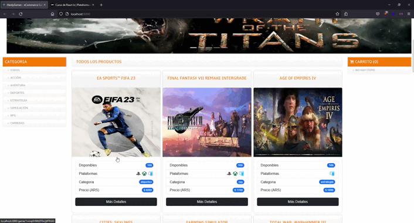

# HardyGames - Simulador de E-Commerce de Videojuegos

HardyGames - Ecommerce es una aplicación que genera una orden de compra de videojuegos. Fue desarrollada durante el curso de React JS dictado por Coderhouse, es una app funcional para simular una compra online. Todos los datos son obtenidos y almacenados en la nube utilizando los servicios de Firebase/Firestore.

## Demo version final
En el siguiente link podrás ver una demostración en tiempo de real del funcionamiento de la app. [HardyGames - Ecommerce](https://hardygames-ecommerce.netlify.app/).

---

## Funcionamiento de la APP

## Tecnologias utilizadas

Para este proyecto se utilizó las siguientes tecnologías:

- React JS
- Bootstrap 5.2.1
- Bootstrap Icons
- SweetAlert2
- Firebase / Firestore
